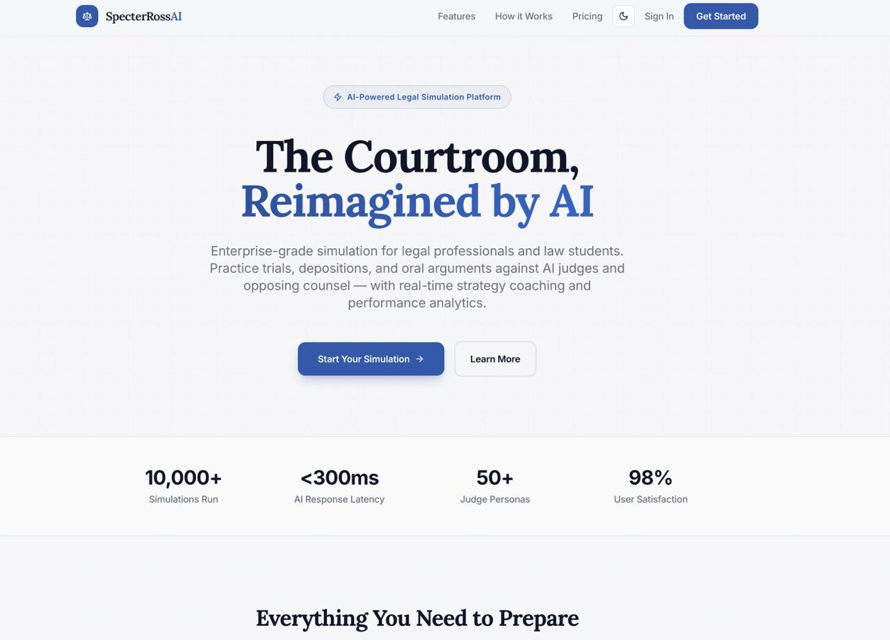
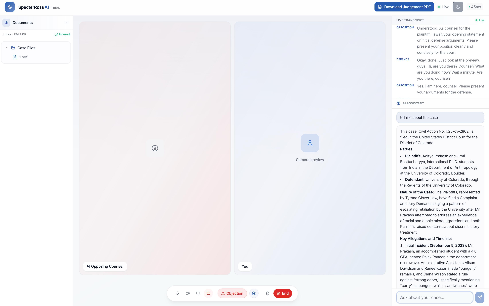
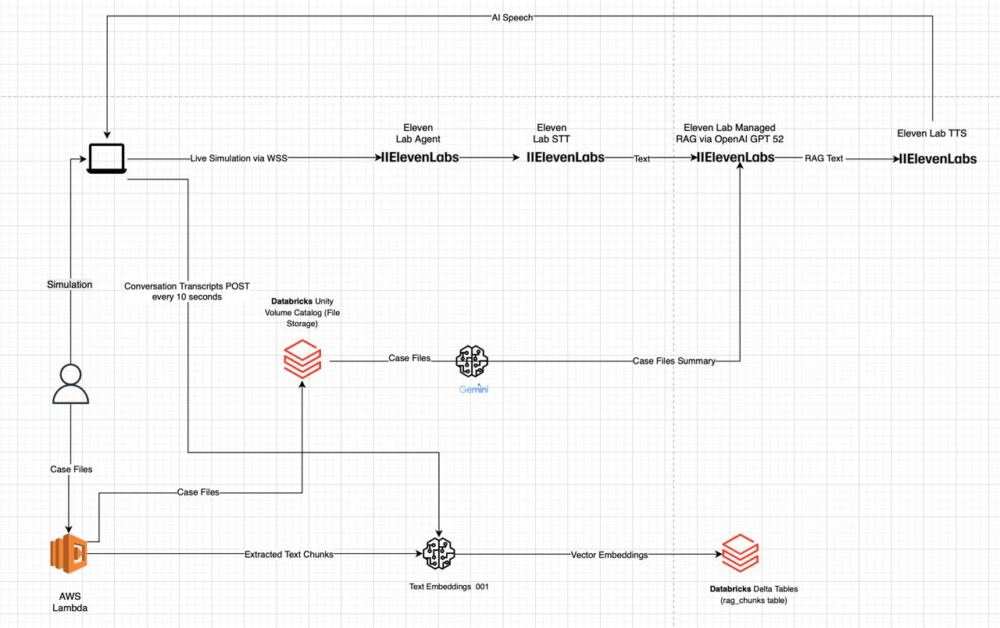

# SpecterRoss AI

**The Courtroom, Reimagined by AI.**

Enterprise-grade simulation for legal professionals and law students. Practice trials, depositions, and oral arguments against AI judges and opposing counsel — with real-time strategy coaching and performance analytics.

<p align="center">
  
</p>

## What is SpecterRoss AI?

SpecterRoss AI puts you in a live courtroom simulation powered by voice AI. Upload your case files, step into a virtual courtroom, and argue against an AI opposing counsel that responds in real time — all while an AI assistant helps you analyze the case on the fly.

### Key Highlights

- **10,000+** simulations run
- **<300ms** AI response latency
- **50+** judge personas
- **98%** user satisfaction

## Intelligence Engine in Action

The simulation interface brings together live video, real-time transcription, an AI case assistant, and courtroom controls into a single view — so you can focus on building your argument.

<p align="center">
  
</p>

**What you see above:**
- **AI Opposing Counsel** — a voice-driven adversary that responds to your arguments in real time
- **Live Transcript** — every statement captured as it happens
- **AI Assistant** — ask questions about your case files and get instant analysis
- **Courtroom Controls** — object, present evidence, or end the session at any time

## System Design

<p align="center">
  
</p>

The platform orchestrates several services end-to-end:

1. **Live Simulation** — The user connects via WebSocket to an ElevenLabs Agent, which handles speech-to-text, RAG-powered reasoning (via OpenAI GPT), and text-to-speech in a single streaming loop.
2. **Case File Ingestion** — Uploaded case files are processed by AWS Lambda, chunked, embedded via Text Embeddings, and stored in Databricks Delta Tables for retrieval.
3. **Case Summarization** — Gemini generates case file summaries from documents stored in Databricks Unity Volume Catalog.
4. **Conversation Transcripts** — Transcripts are posted every 10 seconds to Databricks for persistence and analytics.

## Tech Stack

| Layer | Technologies |
|---|---|
| **Frontend** | React, TypeScript, Vite, shadcn-ui, Tailwind CSS |
| **Backend** | Python, FastAPI, WebSockets, ElevenLabs SDK |
| **AI/ML** | ElevenLabs (Agent, STT, TTS), OpenAI GPT (RAG), Gemini (Summarization), Text Embeddings |
| **Data** | Databricks (Unity Volume Catalog, Delta Tables), AWS Lambda |

## Getting Started

### Prerequisites

- Python 3.10+
- Node.js 18+ & npm
- ElevenLabs API key

### Backend

```bash
cd backend
python -m venv venv
source venv/bin/activate
pip install -r requirements.txt
cp .env.example .env  # configure your API keys
python -m uvicorn src.main:app --reload --host 0.0.0.0 --port 8000
```

### Frontend

```bash
cd frontend
npm install
npm run dev
```

## License

All rights reserved.
